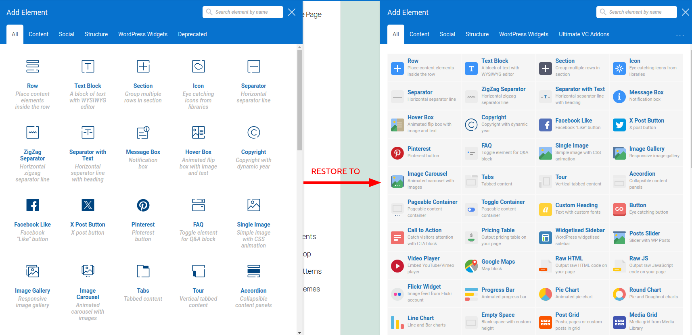
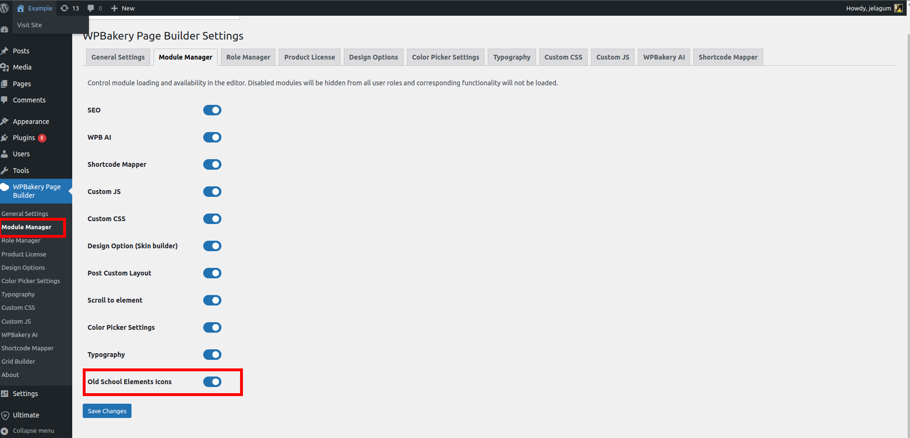

## Description

This WordPress plugin adds a module to WPBakery Page Builder, bringing back the old school style of editor elements icons used in versions prior to 8.0.

## Installation
You can directly install the plugin from the GitHub repository.
1. Clone the repository to the `/wp-content/plugins/` directory.
2. Activate the plugin through the 'Plugins' menu in WordPress.

That's it. Right now if you go to any WPBakery Page Builder editor you can enjoy old-school element icons.

## Requirements
1. WPBakery Page Builder version 8.0+
2. PHP version 5.6+
3. Wordpress version 4.9+

And remember as this plugin is just a regular WPBakery module you can always switch it on/off in WPBakery modules settings.

