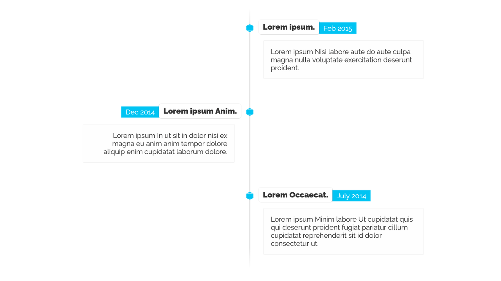
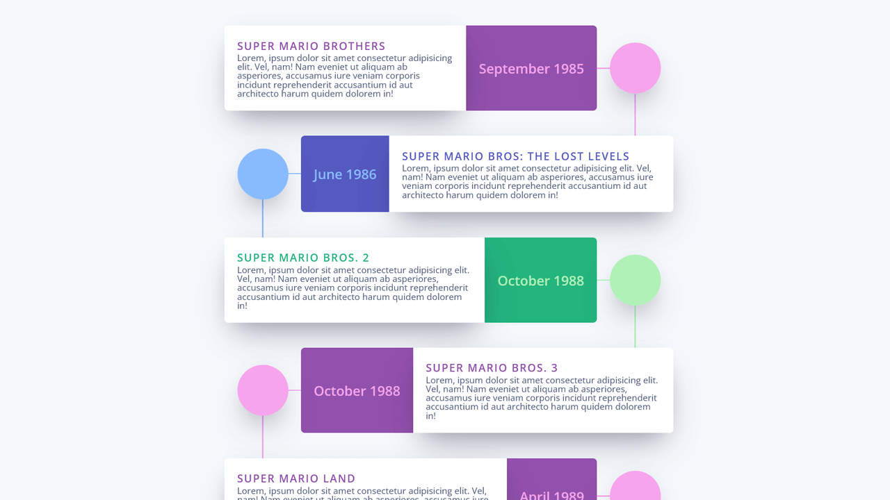
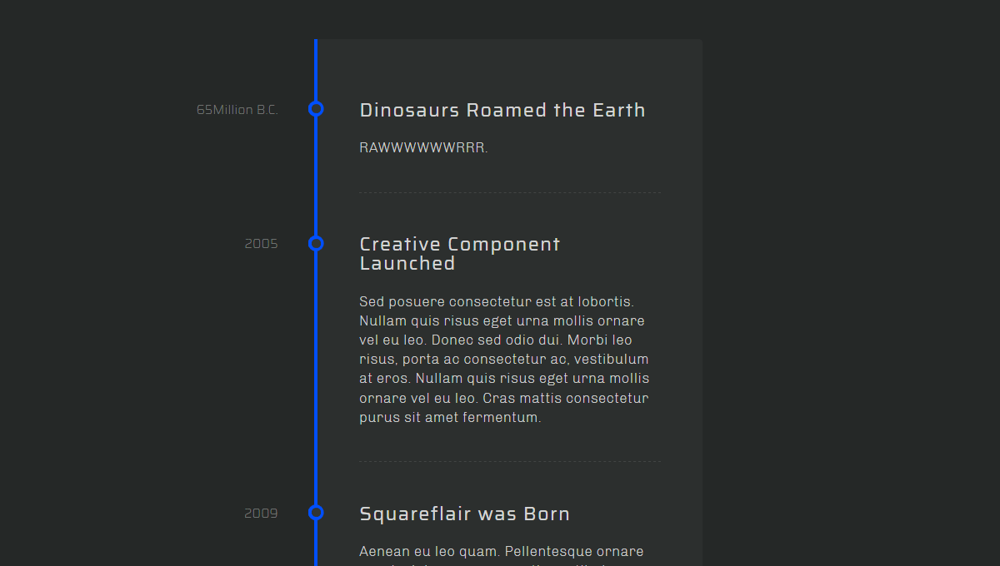
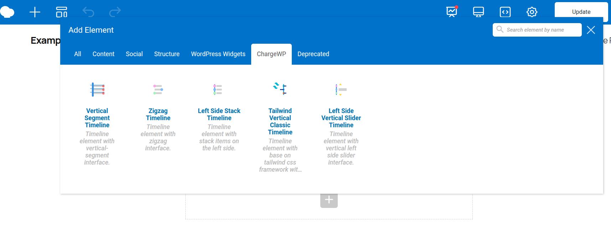

## Description

This WordPress plugin introduces three new, well-crafted timeline elements for the [WPBakery Page Builder](https://wpbakery.com/).

### 1. Vertical Timeline Element.

### 2. ZigZag Timeline Element.

### 2. Vertical Segment Timeline Element.

## Installation
You can directly install the plugin from the GitHub repository.
1. Clone the repository to the `/wp-content/plugins/` directory.
2. Activate the plugin through the 'Plugins' menu in WordPress.

That's it. If you go to the WPBakery Page Builder editor you can enjoy new timeline elements.

## Requirements
1. WPBakery Page Builder version 5.0+
2. PHP version 5.6+
3. Wordpress version 4.9+
