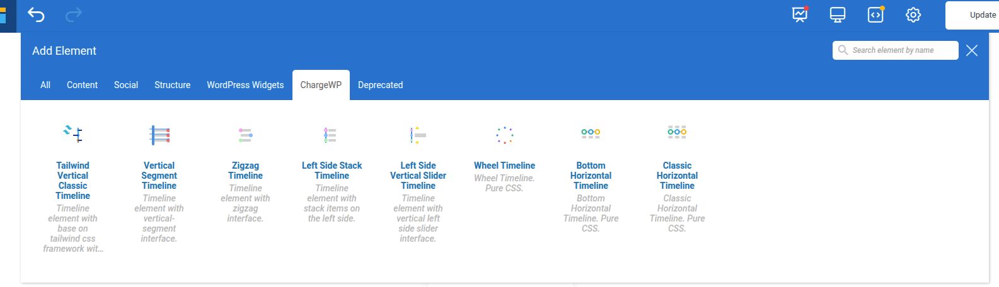

## Description

This WordPress plugin introduces well-crafted and fully customizable timeline addons for the [WPBakery Page Builder](https://wpbakery.com/). All addons support both the front-end and back-end WPBakery editors. 

If you need to organize and present information in chronological order, making it easier for your users to understand the content on your web page, this plugin offers many addons to help with that. 

The WPBakery Page Builder plugin must be installed and activated to use this plugin. Once the required plugins are activated, the elements will be available for use in any WPBakery editor.

### 1. Vertical Timeline Addon.

### 2. ZigZag Timeline Addon.

### 3. Vertical Segment Timeline Addon.

### 4. Left Side Stack Timeline.

## Installation
You can directly install the plugin from the GitHub repository.
1. Clone the repository to the `/wp-content/plugins/` directory.
2. Activate the plugin through the 'Plugins' menu in WordPress.

That's it! If you go to any WPBakery Page Builder editor, you'll find new elements under the 'ChargeWp' tab in the 'Add Element' WPBakery popup.

## Requirements
1. WPBakery Page Builder version 5.0+
2. PHP version 5.6+
3. Wordpress version 4.9+
   
## Browser support
1. Chrome version 49+
2. Safari 12+
3. Firefox 78+
4. Edge: Chromium-based Edge (79+)
